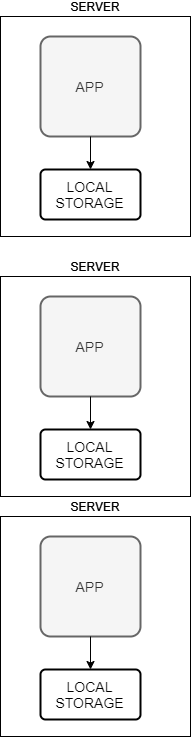
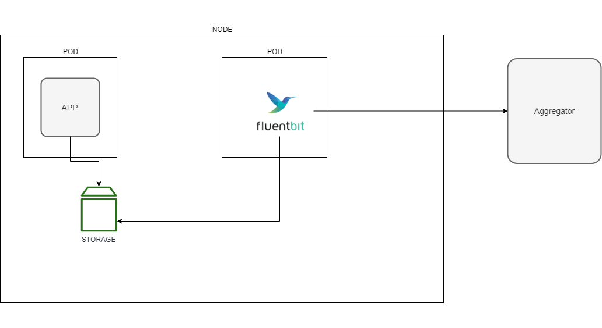
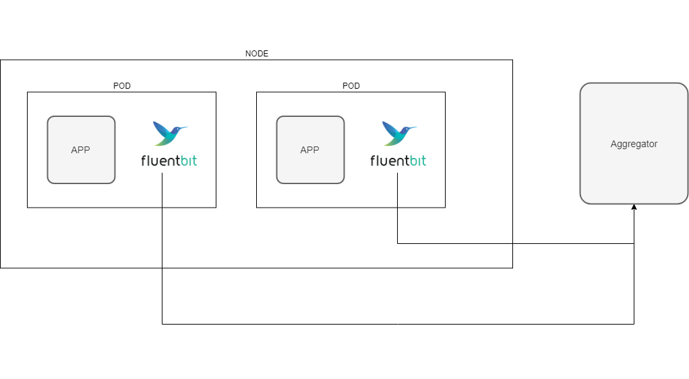
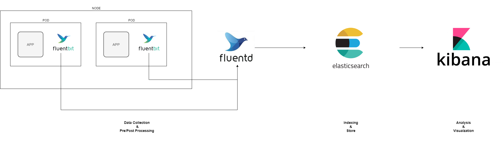

# Cloud Native Logging

## Legacy



- 고사양의 서버에 Application을 크게 운영
- Log를 Application이 실행 중인 서버 내부에 저장
- 개발자/운영자는 서버 내부에 접속해 Log를 확인하거나 별도의 툴을 만들어서 확인

## Cloud Native



- Application을 작게 운영하고 필요할 때 마다 확장
- 다중 인스턴스의 로그를 효율적으로 검색하기 위해 외부 Log 시스템에 저장
- 개발자/운영자는 서버에 직접 접속하지 않고 외부 Log 운영툴에서 로그 확인

## Sidecar Pattern



- pod내부의 fluent-bit를 둬서 application log 및 지정된 was log를 Aggeregator에 넘겨 수집


## Cloud Native Example



- fluent-bit가 수집해서 fluentd가 Aggeregator역활을 하며 es로 저장 및 인덱스해서 Kibana에서 로그 확인

## Istio Sidecar Network

- . Istio가 설정된 컨테이너는 initContainer로 Iptables를 이용해서 모든 트레픽이 Envoy Proxy로 가게 세팅되어있다.

`iptables -t nat -S`

로 트래픽 확인가능
확인해보면 15001번 포트로 트래픽을 보내는것을 알수있다. 15001은 Envoy Proxy

```
# Configuration for logentry instances
apiVersion: "config.istio.io/v1alpha2"
kind: logentry
metadata:
name: newlog
namespace: istio-system
spec:
severity: '"info"'
timestamp: request.time
variables:
source: source.labels["app"] | source.workload.name | "unknown"
user: source.user | "unknown"
destination: destination.labels["app"] | destination.workload.name |
"unknown"
responseCode: response.code | 0
responseSize: response.size | 0
latency: response.duration | "0ms"
monitored_resource_type: '"UNSPECIFIED"'
---
# Configuration for a Fluentd handler
apiVersion: "config.istio.io/v1alpha2"
kind: fluentd
metadata:
name: handler
namespace: istio-system
spec:
address: "fluentd-es.logging:24224"
---
# Rule to send logentry instances to the Fluentd handler
apiVersion: "config.istio.io/v1alpha2"
kind: rule
metadata:
name: newlogtofluentd
namespace: istio-system
spec:
match: "true" # match for all requests
actions:
- handler: handler.fluentd
instances:
- newlog.logentry
---

```

## Conclusion
cloud 환경에서는 더이상 legacy 처럼 서버에 들어가서 로그를 보는 형태는 불가능하다
로그를 동적으로 관제시스템과 연결하여 어플리케이션을 관리해야된다.
사이드카패턴으로 application과 분리하여 지속적인 ci/cd도 가능해졌다 
그중 td-agent-bit(fluentd-bit) - td-agent(fluentd) 의 확장성 및 성능은 정말 뛰어난 오픈소스 인것 같다.
